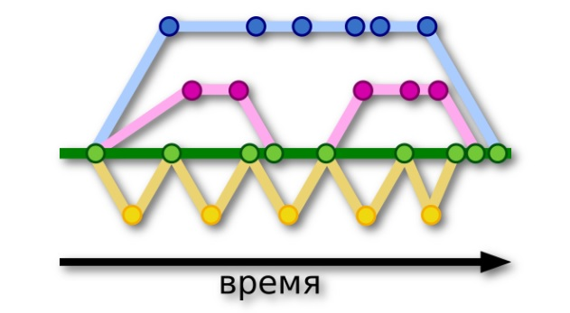

[< на главную](./readme.md)

# **Ветвление**

Ключевая особенность *Git* — ветвление, позволяющее работать над разными версиями проекта. Таким образом, вместо одного перечня с упорядоченными коммитами история может расходиться в некоторых точках, поэтому становится похожей на дерево. 

Cхематично выглядит так:

##### фото из источника [SkillFactory](https://lms.skillfactory.ru/courses/course-v1:SkillFactory+PHPDEV+2021/courseware/d27ba083970241e4b9c5fcb835addce9/ea69748ba20c4e858a6d364ec0b51108/9?activate_block_id=block-v1%3ASkillFactory%2BPHPDEV%2B2021%2Btype%40vertical%2Bblock%402b38704bbcf8426f888023a41b553184)

**Кругами** изображены точки-фиксации изменений в репозитории (коммиты)

**Зелёная ветка** — ветка программы, которая доступна пользователям.

В итоге, все изменения, созданные разработчиками, вносятся в общую ветку.

`Создание ветки и переключение на ветку:`
>git branch [наименование] — команда, которая создает новую ветку в репозитории.

>git checkout [наименование] — команда, которая переключает вас на определенную ветку.

>git checkout -b [наименование] — создаёт новую ветку и переключает вас на неё.

`Объединение ветвей:`

>git merge [наименование] — поглощение. Вносит коммиты из другой ветки в текущую.

>git rebase[наименование] — перебазирование. В этом случае коммиты вашей ветки накладываются поверх текущего состояния указанной ветки.