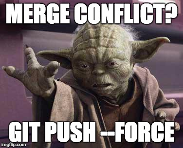

[< на главную](./readme.md)


# **Конфликты**

При работе с исходным кодом часто встречаются ситуации, когда один и тот же код редактируется разными разработчиками одновременно. При слиянии программного кода в этом случае система контроля версий не может определить, какой код считается правильным.


##### Фото [Zacernst](https://imgflip.com/user/zacernst)

```
Как избежать кончликтов?
```

1. Решайте задачи таким образом, чтобы разработчики не производили изменения в одних и тех же участках кода одновременно. 
2. Работайте с актуальной версией кода. Произошло изменение ветки, с которой предстоит слияние — вытяните эти изменения.
3. Выработайте и соблюдайте требования к настройкам редактора кода, оформлению кода, используйте *editorconfig.*
4. Внесите локальные настройки проекта и другие ЛОКАЛЬНЫЕ файлы в *.gitignore*
5. Соблюдайте рекомендации к разделению сущностей в различные файлы.
6. Соблюдайте рекомендации к наименованиям и иерархии.

`Что делать в случае конфликта?`
 Всё просто — требуется вручную написать результирующий код, а после этого зафиксировать (закоммитить) изменения. Многие IDE, интегрированные с GIT, представляют удобный интерфейс для решения конфликтов.