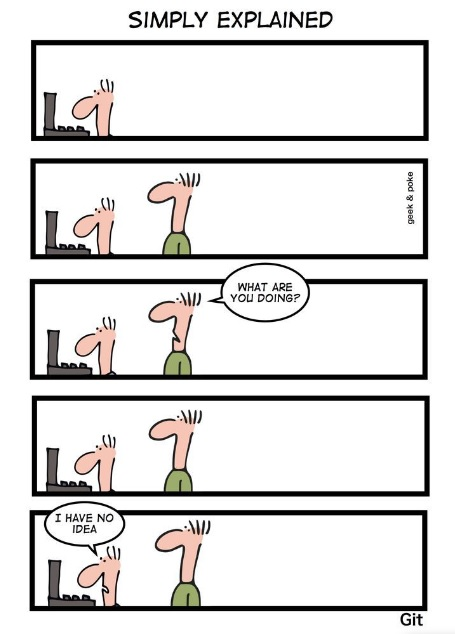

[< на главную](./readme.md)

# **Заключение**

###### фото [Simply Explained](https://geekandpoke.typepad.com/geekandpoke/2012/07/simply-explained-2.html)

### Мы рассмотрели, как устанавливать и настраивать Git в различных ОС, создавать новые и клонировать существующие репозитории, получать и отправлять новые версии проекта, а также ознакомились с базовыми концепциями ведения веток.

### Этой информации обычно хватает для повседневных задач, связанных с хранением рабочих проектов.

### В любов случае, тебе понадобится не мало времени чтобы "въехать" в профессию разработчика. Не отчаивайся! У тебя всё получится. 