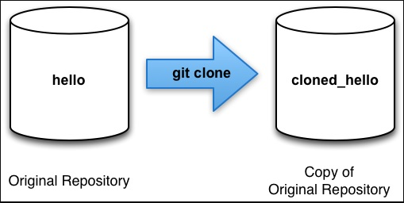

[< на главную](./readme.md)
***

### **GIT clone**

Эта команда служит для создания копии репозитория.

Клонировать можно как локальный (находящийся на вашем компьютере), так и удалённый (находящийся в сети) репозиторий.

##### Фото взято из [HugeDomains](https://www.hugedomains.com/domain_profile.cfm?d=techidiocy.com)

`Пример:`

> *git clone https://github.com/avsudnichnikov/example*
