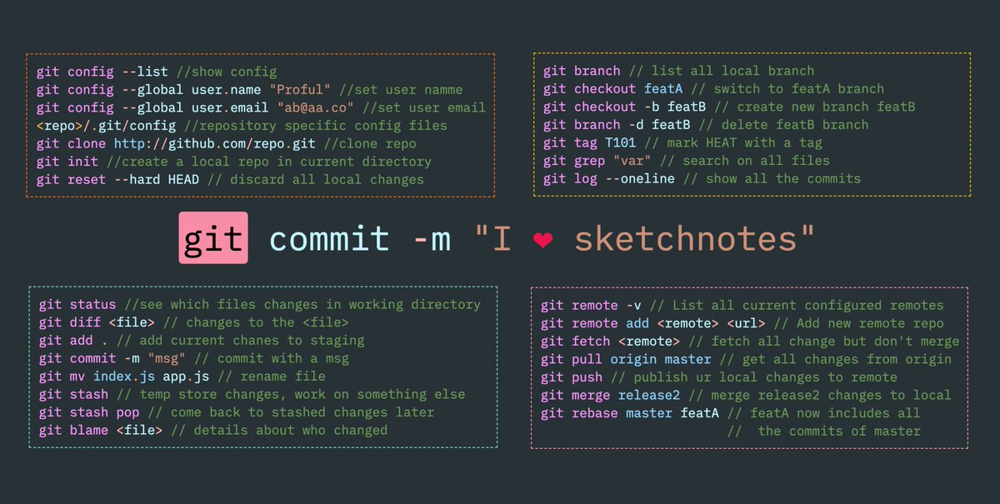

[< на главную](./readme.md)
***

# **GIT commit**

Это команда *Git* для записи индексированных изменений в репозиторий.

Команды **git add** и **git commit** составляют основу рабочего процесса *Git*. Эти две команды должен изучить и понимать каждый пользователь *Git*, независимо от модели совместной работы, принятой в его команде. Эти команды используются для записи версий проекта в историю репозитория.

Работа над проектом ведется по стандартной схеме **«редактирование — индексирование — коммит»**. 
Сначала вы редактируете файлы в рабочем каталоге. Когда вы будете готовы сохранить копию текущего состояния проекта, вы индексируете изменения командой 
> **git add**. 

Затем вы вызываете команду 
> **git commit**

которая добавляет проиндексированный снимок состояния в историю проекта.

```
Команды.
```

`Создать новый коммит:`

>git commit -m'сообщение'


`Включить новые изменения в последний созданный коммит:`

>git commit --amend [-m'сообщение']

`Не создавать коммит, а только показать отчет и детальную информацию о нем, как если бы он был создан. (Используется для проверки на ошибки перед реальным коммитом):`

>git commit --dry-run


`Показать сведения о последних выполненных коммитах:`

>git log



###### Изображение взято из [twitter](https://twitter.com/profulsadangi/status/1311319902049972226) (запрещен в РФ)


```
**Помни!**
```

1. Текст коммита формируется из трёх частей:

> действие (добавление, исправление, рефакторинг…);

> сущность (документация, счета, главная страница…);

> подробности (задача №23, несуществующий пользователь, зависимости…) — необязательное поле.

2. Полнота — не многословие. Давайте достаточно информации, но без подробностей;
3. Используйте в коммитах английский язык;
4. Найдите свой стиль.  Ознакомьтесь с различными практиками, соблюдайте требования команды.


```
Несколько «стандартных» слов
```

`init` — инициализация;

`add` — добавление;

`delete` — удаление;

`update` — изменение;

`fix` — исправление;

`refactor` — рефакторинг кода приложения;

`style` — исправление опечаток, форматирования;

`docs` — всё, что касается документации;

`test` — всё, что связано с тестированием;

`merged, fix `conflict` — слияние, решение конфликта.