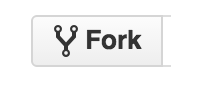

[< на главную](./readme.md)

# **GIT fork**

***Fork*** - собственный проект, основанный на другом проекте.
1. Форк сохраняет связь с проектом-родителем, по которой он может получить изменения из проекта-родителя;
2. Форк сохраняет связь с проектом-родителем, по которой он может передать изменения в проект-родитель. Это используется в модели ветвления Forking Workflow.

На *GitHub* форк создаётся с помощью кнопки `«fork»`, которая расположена в интерфейсе при просмотре **чужих** проектов.

