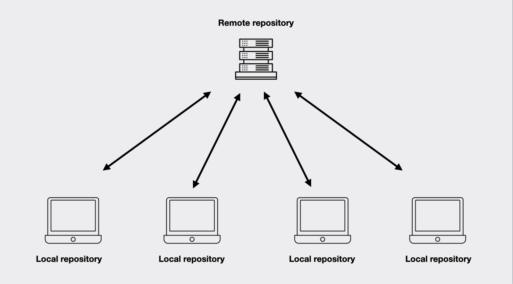

[< на главную](./readme.md)

# **Удаленный репозиторий**

##### Фото из источник [Freecode](https://www.freecodecamp.org/news/what-is-git-learn-git-version-control/)

 Удалённые репозитории это версии вашего IT-проекта, сохраненные в локальной или интернет сети. При совместной работе над проектом предполагается внесение изменений в удаленный репозиторий.

>git remote add [имя_удаленного_репозитория] [адрес] используется для добавления связанных удаленных репозиториев.

`При этом приходит список изменений, но они не вносятся в код, используемый в локальном репозитории.`

>git merge используется для слияния полученных изменений и локального репозитория.

>git pull является объединением двух последовательных команд **git fetch** и **git merge.**

>git push производит отправку ваших изменений в репозиторий. 

`Получение данных о состоянии репозитория`
>git status позволяет отследить состояние репозитория. Позволяет узнать, какие изменения необходимо зарегистрировать Git (при необходимости — отменить).

>git log покажет список последних коммитов и их хеши SHA1. Список выводится начиная с последнего коммита.

>git show [хэш] показывает информацию по определённому коммиту.

